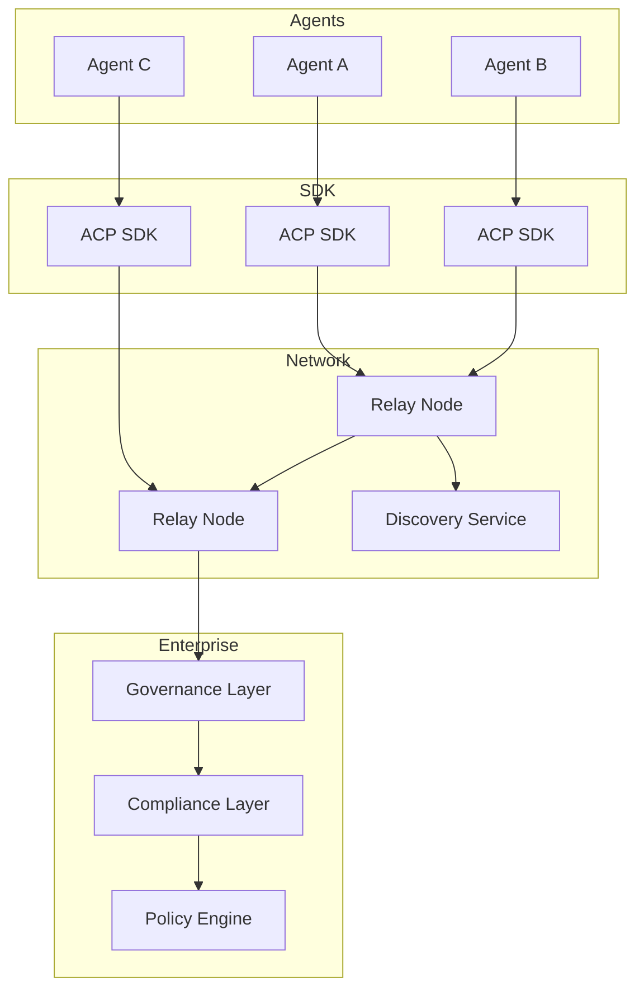
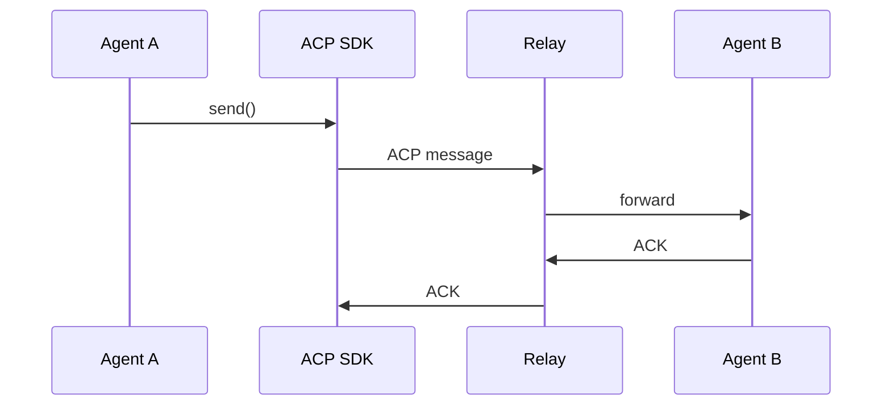

# ACP Reference Architecture

## Overview

The ACP reference architecture describes how agents, SDKs, relays, and discovery services interact.

ACP is structured in three layers:

1. Protocol Layer (ACP specification)
2. Network Layer (relay infrastructure and discovery)
3. Enterprise Layer (governance, compliance, policy)

---

## High-Level Architecture

---

## Component Responsibilities

### Agents
Autonomous software entities that perform tasks and communicate using ACP.

### ACP SDK
Handles protocol operations:

- encryption
- identity management
- discovery
- routing
- delivery state tracking

### Relay Nodes
Forward encrypted messages between agents.

Responsibilities:

- envelope validation
- routing
- optional store-and-forward

Relays must never decrypt payloads.

### Discovery Service
Resolves agent identifiers into identity documents and reachability hints.

### Enterprise Layer
Optional enterprise services providing:

- governance
- compliance logging
- policy enforcement
- regulated identity frameworks

---

## Message Flow Example

---

## Design Goals

- secure end-to-end communication
- infrastructure optionality
- decentralized discovery
- extensibility for enterprise use
