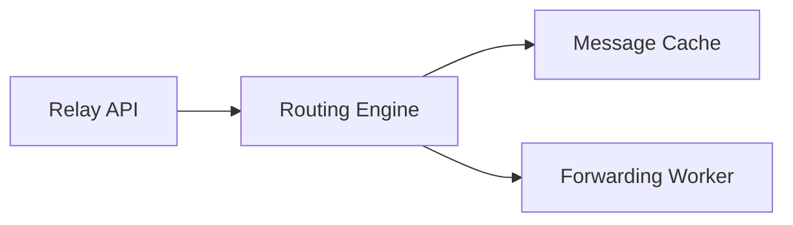

# ACP Minimal Reference Implementation Plan

## Objective

Create a minimal ACP implementation that demonstrates the protocol and enables developer adoption.

The first implementation should include:

- a reference SDK
- a minimal relay server
- identity document handling
- discovery support

---

## Core Components

### 1. ACP SDK

Responsibilities:

- generate agent identity
- encrypt/decrypt payloads
- sign/verify messages
- perform discovery
- send and receive ACP messages

Recommended languages:

- Python
- JavaScript / Node.js

These maximize early developer adoption.

---

### 2. Reference Relay

A minimal relay implementation should support:

- receiving ACP messages
- envelope validation
- forwarding messages
- optional in-memory buffering

Recommended architecture:



Implementation options:

- Go
- Rust
- Node.js

---

### 3. Discovery Service

A simple discovery implementation could provide:

- `.well-known/acp/agents/<name>` endpoint
- identity document hosting
- basic relay hints

This can initially be static hosting.

---

## Minimal Feature Set

The first prototype should support:

- SEND
- ACK
- FAIL
- basic discovery
- identity document generation
- encrypted payloads

This is enough to demonstrate the protocol.

---

## Developer Experience

Minimal usage example:

```python
from acp import Agent

agent = Agent.create("agent:test.bot@example.com")

agent.send(
    recipients=["agent:receiver.bot@example.com"],
    payload={"task": "hello"}
)
```

The SDK should hide protocol complexity.

---

## Deployment Targets

Reference components should run easily in:

- Docker containers
- local development environments
- simple cloud deployments
